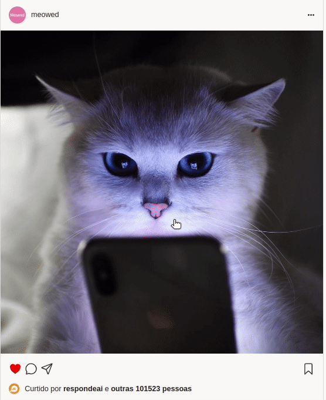

# Informações sobre o projeto!

Acesse o projeto: <a href="https://mateuspit.github.io/projeto7-instagramreact/"> Instagram react </a>

Acesse informações sobre o projeto:

<a href="#Contextualizacao">Contextualização</a> 
  <a href="#Tecnologias">Tecnologias utilizadas </a>
<a href="#Requisitos">Requisitos do projeto </a>

Contextualização:
 
Este projeto foi desenvolvido para trabalhar os conceitos aprendidos sobre React mais especificamente: conceito de componentização, as props dos componentes do React e, por fim, estado do componente utilizando useState. Este é o primeiro projeto de React, portanto, tem baixa complexidade.

Tecnologias utilizadas:
 
Neste projeto foram utilizados HTML, CSS, JavaScript e React. Todo o projeto foi versionado utilizando git e github. O projeto foi codificado utilizando o editor de texto, VS Code.

Requisitos do projeto:

- Você deve criar seu projeto usando o comando create-react-app:
- Arquivos CSS devem ser colocados na pasta public e linkados diretamente no index.html da pasta public.
- Você também deve criar, dentro da `public`, uma pasta `assets` para colocar as imagens.
- A página deve ser componentizada em arquivos diferentes, utilizando import/export:
  

    
    
        Componentes
    

  - App 
  - Corpo 
  - SideBar 
  - NavBar 
  - Usuario 
  - Stories 
  - Posts 
  - Sugestoes 
  

   

- Todos os itens repetitivos do projeto devem ser representados como Arrays/Objetos nos componentes e renderizados no JSX usando
  

  

  Itens pretitivos
  

  - Os stories (deve ter pelo menos 3 stories) 
  - Os posts (deve ter pelo menos 3 posts) 
  - As sugestões de seguidores (deve ter pelo menos 3 sugestões) 
  

- Nome de usuário (ao apertar o lápis, aparece um prompt para alterá-lo). Se for passada uma string vazia, não atualiza. 
- Imagem de perfil (ao clicar uma vez na imagem, aparece um `prompt` pedindo novo link). Se for passada uma string vazia, não atualiza. 
- Salvar o post (ao clicar no ícone de salvar o post, ele deverá ficar preenchido). 
  - Caso a postagem já esteja salva, ao clicar no ícone, a postagem deve passar para não salva. 
- Ao clicar no ícone do like o usuário poderá curtir a postagem. Ou seja, o ícone de coração deverá ficar preenchido e vermelho.
  - Caso a postagem já esteja curtida, ao clicar no ícone, a postagem deve passar para não curtida.
- Ao clicar na imagem de um post do feed, o usuário poderá curtir a postagem, ou seja, o botão do like deverá ficar preenchido em vermelho.
  - Ao clicar na imagem de um post do feed, o usuário poderá curtir a postagem, ou seja, o botão do like deverá ficar preenchido em vermelho.
- Sobre a frase de “Curtido por fulano e outras xxx pessoas”.

Bônus (OPCIONAL)

- Para dar like clicando na imagem, é necessário clicar duas vezes seguidas, rapidamente. 
  - Clicar duas vezes com um intervalo de tempo grande NÃO CONFIGURA double click. Só serão aceitas implementações usando onDoubleClick do React ou evento nativo equivalente. 
- Quando ocorrer o double click na imagem, deverá surgir no centro da imagem um coração, que primeiro cresce e depois desaparece, como na imagem abaixo. 

  

  

  

